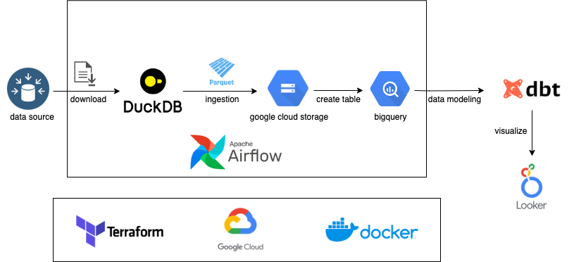
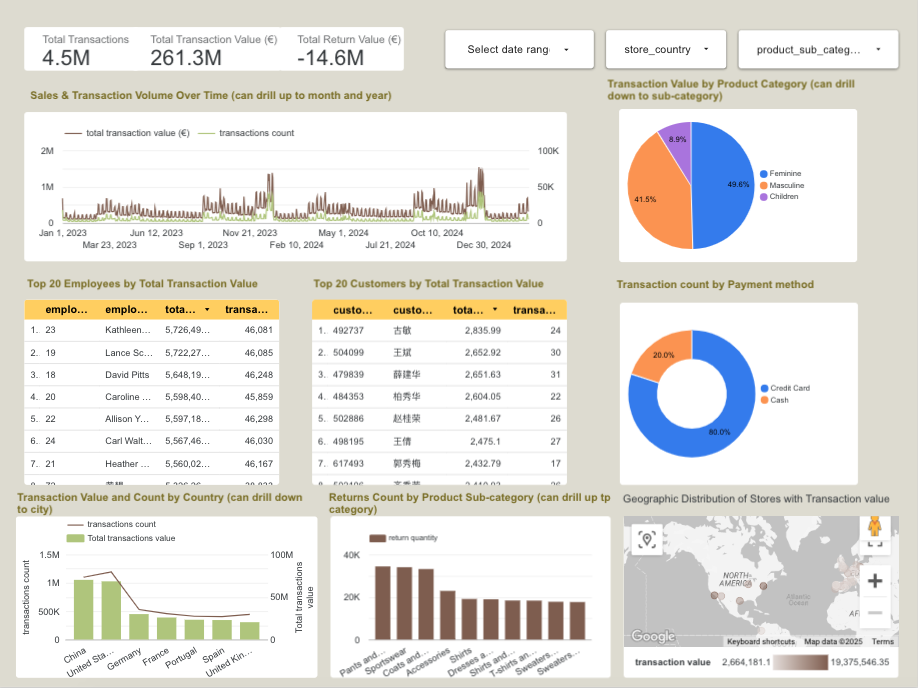

# Fashion Retail Sales Data Analysis

A data pipeline with dbt, Docker, Airflow, Terraform, BigQuery, and Looker Studio!

## Description

### Objective

The fashion retail industry is dynamic, with vast amounts of transaction, product, and customer data flowing daily. Analyzing this data is crucial for gaining insights into sales trends, customer preferences, and inventory management. This project aims to build an ELT pipeline to thoroughly analyze and model fashion retail sales data, creating a data mart that can power decision-making, optimize product offerings, and enhance the customer shopping experience.

The pipeline extracts, loads, and transforms data from various sources like transaction records, product data, employee details, and store information. The goal is to aggregate this data and provide a comprehensive analysis for the retail industry, helping stakeholders optimize sales strategies, manage inventory more effectively, and predict future sales trends.

### Dataset

The dataset for this project includes sales transactions from a fashion retail company, covering various customer, product, store, and employee details. It includes transaction-level data from different product categories, payment methods, discount details, and more.

We use the following data:

- **Transactions Data**: Contains details about each sale, including transaction IDs, customer IDs, product IDs, prices, quantities, and more.
- **Customer Data**: Information about customers, including names and demographics.
- **Product Data**: Includes details of products like product IDs, names, categories, colors, sizes, and prices.
- **Employee Data**: Data related to employees who processed the transactions.
- **Store Data**: Information about the retail stores, including store locations and employee assignments.

The pipeline builds out fact and dimension tables to model the data, providing a clear, analytical view of the sales performance and customer interactions.

**Data Schema**

### Tools & Technologies

- Cloud - [**Google Cloud Platform**](https://cloud.google.com/)

- Infrastructure as Code tool - [**Terraform**](https://www.terraform.io/)
- Containerization - [**Docker**](https://www.docker.com/), [**Docker Compose**](https://docs.docker.com/compose/)

- Orchestration tool - [**Airflow**](https://airflow.apache.org/)

- Transformation - [**dbt**](https://www.getdbt.com/)

- Data Lake - [**Google Cloud Storage**](https://cloud.google.com/storage)

- Data Warehouse - [**BigQuery**](https://cloud.google.com/bigquery)
- Data Visualization - [**Looker Studio**](https://datastudio.google.com/overview)
- Programming Language - [**Python**](https://www.python.org/)
- Other tools - [**DuckDB**](https://duckdb.org/)

### Architecture

### Final Dashboard
Click here to see the final report: [Global Fashion Retail Sales Report](https://lookerstudio.google.com/reporting/00949454-9e37-4db1-a51f-732a993c8556)

## Setup

- Google cloud platform environment - [Setup](./setup/GCP-setup.md)
- Create infra on GCP with Terraform - [Setup](./setup/Terraform-setup.md)
- Airflow orchestration - [Setup](./setup/Airflow-Setup.md)

## Summary

### Cloud Platform
The project is implemented on Google Cloud Platform (GCP) and utilizes Terraform for automating cloud resource deployment. All data pipelines, warehouses, and analytics are run in the cloud environment to ensure scalability and high availability.

### Data Ingestion (Batch Processing)
Data ingestion is done in batch mode, where Airflow orchestrates the extraction of data from multiple sources (such as sales, discounts, inventory, etc.) and loads it into the data warehouse. The batch data from each source undergoes an ELT pipeline process to ensure smooth subsequent analysis and modeling.

### Workflow Orchestration
The entire data pipeline workflow is managed by Airflow, covering data extraction, cleaning, loading, and transformation steps. Airflow regularly runs DAG tasks to ensure efficient data processing and timely updates, managing dependencies between tasks using Directed Acyclic Graphs (DAGs).

### Data Warehouse
BigQuery is used as the data warehouse for the project. The transactions table is partitioned by the `date` column to optimize query performance on large datasets.

### Data Transformations (dbt)
Data transformations are handled using dbt. Multiple data models have been defined with dbt to clean and transform data related to sales, customers, products, and more.

### Dashboard
The Looker Studio dashboard in the project provides real-time views of key KPIs (such as total transaction value, sales quantity, customer behavior, etc.). This dashboard enables business stakeholders to easily track sales performance, product trends, and other metrics, supporting quick decision-making.

### Reproducibility
The project includes detailed deployment documentation and operation steps, ensuring that users can easily replicate the project and get started quickly.
