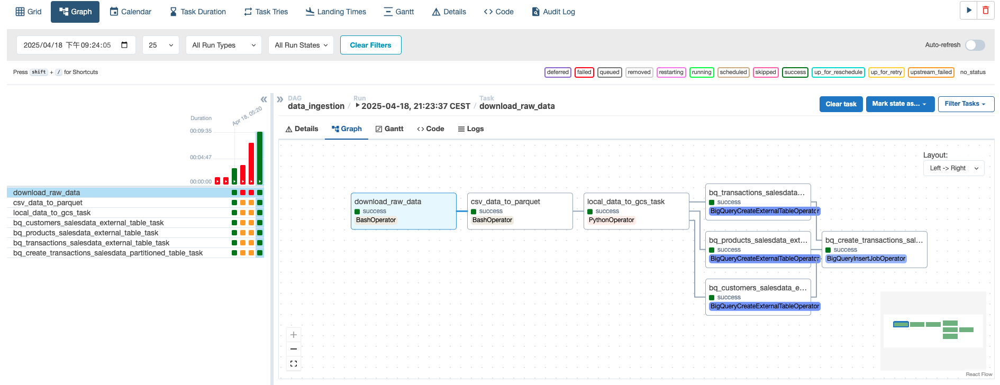

# Airflow Setup

## Setup

1. Navigate to the `airflow` folder.

2. Mount a volume for Google cloud credentials. In the `docker-compose.yml` file, create a volume between the local google cloud credentials file.

   ```yaml
   volumes:
     - ./dags:/opt/airflow/dags
     - ./logs:/opt/airflow/logs
     - ./plugins:/opt/airflow/plugins
     - ./scripts:/opt/airflow/scripts
     # read-only
     - ~/.google/credentials/:/.google/credentials:ro
     - ./data:/opt/airflow/data
   ```

3. Change the relevant settings in `.env` file.

   ```
   AIRFLOW_UID=501
   AIRFLOW_HOME=/opt/airflow
   GCP_PROJECT_ID=<your_project_id>
   GCP_GCS_BUCKET=fashion_sales_storage_bucket
   BIGQUERY_DATASET=fashion_sales_dataset
   ```
4. Build the image and run airflow:

   ```bash
   # build the custom airflow docker image
   docker-compose build
   # initialize the airflow configs
   docker-compose run airflow-init
   # run airflow
   docker-compose up -d
   ```

5. Airflow GUI should be available on port `8080`. Browse to `localhost:8080`. Log in using the default username and password, both set to **airflow**.

6. Airflow will be running in detached mode. To see the logs from docker, run the following command;

   ```bash
   docker-compose logs --follow
   ```

7. To stop airflow

   ```bash
   docker-compose down
   ```

## DAGs

- data_ingestion dag


